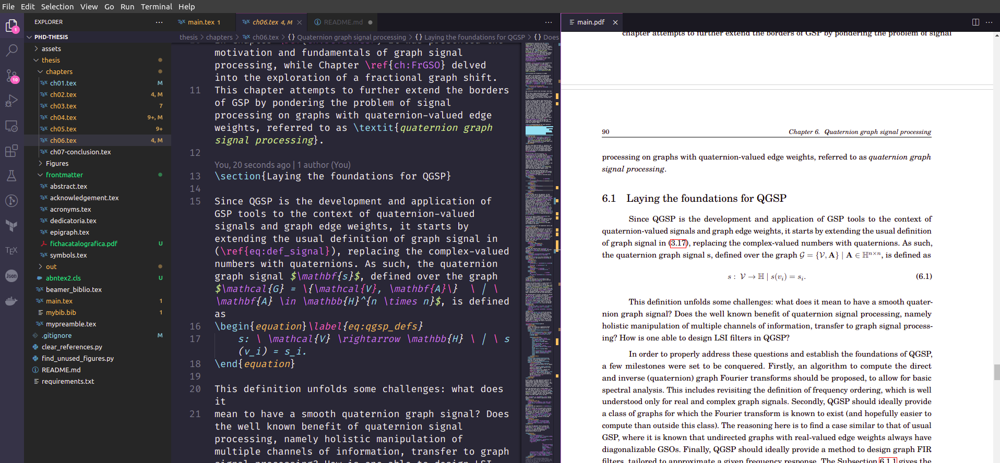

# phd-thesis
TeX files for my PhD Thesis (doctoral dissertation).

See **[here the most recent .pdf version](./thesis/out/main.pdf)**.

### Outside Overleaf: running LaTeX in VSCode 
Recently I moved from using Overleaf to running LaTeX locally with VSCode and docker. This repository is exactly the one I used in the last days of correction of the text. I used as reference the [vscode-latex-docker-template](https://github.com/nuric/vscode-latex-docker-template) repository and [this article on Medium](https://towardsdatascience.com/three-ways-to-create-dockernized-latex-environment-2534163ee0c4).


*Screenshot of the compiled thesis.*

### Adding to the local repository an Overleaf Git remote (deprecated)
In the beginning, this repository shared a remote with the Overleaf Git. Here is how I usually managed the code in both.

As explained in the [Overleaf](https://www.overleaf.com/learn/how-to/Using_Git_and_GitHub) documentation,
one can link this Github repository with the Overleaf project (only in paid subscription), after cloning locally,
by doing so:
```sh
cd phd-thesis
git remote add overleaf https://git.overleaf.com/62d0772f6d2da3875ac89c64
```

Now,
```sh
git remote -v
```
should present as output
```
origin	https://github.com/gboaviagem/phd-thesis.git (fetch)
origin	https://github.com/gboaviagem/phd-thesis.git (push)
overleaf	https://git.overleaf.com/62d0772f6d2da3875ac89c64 (fetch)
overleaf	https://git.overleaf.com/62d0772f6d2da3875ac89c64 (push)
```

To pull the latest content from the Overleaf project and merge it into your `main` branch,
```sh
git pull overleaf master --allow-unrelated-histories
```

Since the main branch in Overleaf if `master`, the push will go a bit differently:
```sh
git push -u overleaf main:master
```
